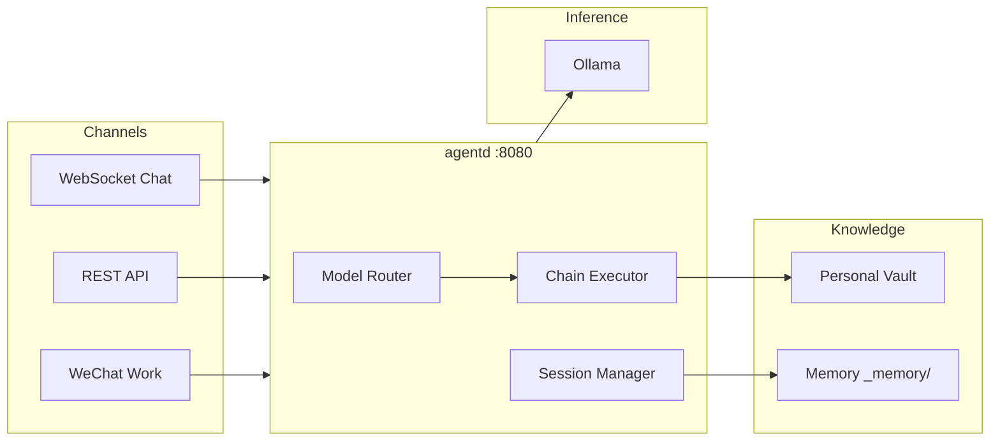

<p align="center">
  <h1 align="center">🤖 Go Agent</h1>
  <p align="center"><strong>A self-hosted AI agent with memory sedimentation, knowledge vault, and LangChain-style pipelines — all running on local LLMs via Ollama.</strong></p>
</p>

<p align="center">
  <a href="#quick-start"></a>
  <a href="./LICENSE"></a>
  <a href="#api"></a>
</p>

---

## What is Go Agent?

Go Agent is a personal AI agent that runs entirely on your machine. It connects to [Ollama](https://ollama.com) for local LLM inference and layers on top:

- **Memory sedimentation** — conversations are automatically distilled into structured knowledge over time
- **Knowledge vault** — dual BM25 + vector search over your personal wiki
- **LangChain-style chains** — composable pipelines for chat, RAG, summarization, synthesis, and wiki ingestion
- **Multi-channel** — chat via WebSocket widget, REST API, or WeChat Work

Think of it as a local, privacy-first AI companion that learns from every conversation.



## Quick Start

### Prerequisites

- **Go 1.26+**
- **Ollama** installed and running on `http://localhost:11434`

Pull the required models:

```bash
ollama pull gemma4:12b    # Chat model
ollama pull bge-m3         # Embedding model
ollama pull llava:7b       # Vision model (optional)
```

### Run

```bash
cd go-agent
go build -o agentd.exe ./cmd/agentd
./agentd.exe
```

Open **http://localhost:8080/chat** and click the chat button in the bottom-right corner.

Or test with curl:

```bash
curl http://localhost:8080/v1/chat/completions \
  -H "Content-Type: application/json" \
  -H "Authorization: Bearer my_local_api_key" \
  -d '{"model":"gemma4:12b","messages":[{"role":"user","content":"Hello!"}]}'
```

## Features

### LangChain-Style Chain Pipeline

Composable steps that form seven built-in chains:

| Chain | Description |
|---|---|
| `chat` | Full conversation with RAG, entity extraction, and memory lookup |
| `simple-answer` | Direct LLM call, no retrieval |
| `rag-answer` | Semantic search + LLM synthesis with source citations |
| `summarize` | Structured summary of long-form content |
| `synthesize` | Cross-document synthesis across vault pages |
| `cross-link` | Discover missing connections between wiki pages |
| `wiki-ingest` | Parse raw content → classify → format → write to vault |

Each chain is composed of small, testable `Step` implementations that pass state through a shared `ChainState` bag. Add custom steps or compose new chains by implementing the `Step` interface.

### Memory Sedimentation Engine

After every conversation, the sedimentation engine runs a multi-stage pipeline:

1. **Value judgment** — is this conversation worth remembering?
2. **LLM summarization** — extract a structured summary (title, decisions, follow-ups)
3. **TF-IDF dedup** — compare against existing `_memory/` entries to avoid duplicates
4. **Persist** — write distilled knowledge back to the personal vault

This means the agent gets smarter over time without manual note-taking.

### Knowledge Vault

- **BM25 keyword search** — fast, exact-match retrieval
- **Vector semantic search** — embedding-based similarity via `bge-m3`
- **Trigger entity extraction** — auto-detects entity mentions in queries and routes to RAG
- **Wiki-compatible** — the vault is a folder of markdown files; edit it with Obsidian or any text editor

### OpenAI-Compatible API

Drop-in replacement for any client that speaks the OpenAI API:

```
POST /v1/chat/completions
POST /v1/embeddings
GET  /v1/models
```

### Multi-Channel Architecture

| Channel | Type | Use case |
|---|---|---|
| WebSocket | Built-in widget | Browser-based chat at `/chat` |
| REST API | OpenAI-compatible | Programmatic access, tool integration |
| WeChat Work | External adapter | Enterprise messaging |

### Session Persistence

Sessions survive restarts. Message history is stored to disk and indexed with vector embeddings for semantic search — ask "what did we discuss about Kubernetes last week?" and the agent finds it.

## Configuration

Edit `go-agent/config/agent.yaml`:

```yaml
server:
  port: 8080
  internal_key: "my_local_api_key"

inference:
  endpoint: "http://localhost:11434"
  models:
    local: "gemma4:12b"
    vision: "llava:7b"
    embedding: "bge-m3"
  timeout: 300s

vaults:
  personal: "D:\\vaults\\personal"   # Your knowledge base
  agent: "D:\\vaults\\agent"         # Agent internal state

session:
  max_rounds: 20
  idle_timeout: 30m
  max_sessions: 100

memory:
  dedup_threshold: 0.45
  min_messages: 3

channels:
  wecom:
    enabled: true
    # ... WeChat Work credentials
```

## Project Structure

```
go-agent/
├── cmd/agentd/main.go          # Entry point
├── config/
│   ├── agent.yaml              # Main configuration
│   └── .env.example
├── internal/
│   ├── core/                   # Agent loop, session manager, model router
│   ├── gateway/                # HTTP server (Gin), WebSocket, RAG pipeline
│   ├── chain/                  # LangChain-style composable pipelines
│   ├── memory/                 # TF-IDF dedup + LLM sedimentation
│   ├── vault/                  # Knowledge base: BM25, vector, chunker, tokenizer
│   ├── inference/              # Ollama client
│   ├── channel/                # Channel abstraction (internal, WeCom)
│   ├── filter/                 # Output filter chain
│   └── agent/                  # Tool definitions
├── static/                     # Frontend widget (chat-widget.js, index.html)
├── tools/                      # Utility CLI tools
├── Makefile
└── dashboard.html              # Admin dashboard
```

## API Reference

All endpoints require `Authorization: Bearer <internal_key>`.

### Chat

```
POST /v1/chat/completions
Content-Type: application/json

{
  "model": "gemma4:12b",
  "messages": [
    {"role": "user", "content": "What is RAG?"}
  ]
}
```

Response includes `sources` array when RAG is triggered.

### Embeddings

```
POST /v1/embeddings
{"model": "bge-m3", "input": "text to embed"}
```

### Internal Endpoints

| Endpoint | Description |
|---|---|
| `GET /health` | Health check |
| `GET /chains` | List registered chains |
| `GET /internal/vault/status` | Vault statistics |
| `GET /internal/vault/search?q=...` | Full-text search |
| `POST /internal/filter/test` | Test output filters |
| `GET /internal/sessions/search?q=...` | Semantic session search |
| `POST /internal/wiki/ingest` | Trigger wiki ingestion chain |
| `GET /sessions` | List past sessions |
| `GET /sessions/:channel/:userId/messages` | Load session history |

### WebSocket

```
ws://localhost:8080/channels/webchat/ws
```

Connect for real-time streaming chat with RAG context injection.

## Development

```bash
# Build
make build

# Run tests
make test

# Vet
make vet

# Cross-compile for Linux (k3s deployment)
make build-linux
```

### Chain Authoring

Add a custom chain:

```go
// 1. Define steps
type myStep struct{}
func (s *myStep) Name() string { return "my-step" }
func (s *myStep) Run(ctx context.Context, state *chain.ChainState) error {
    // read state.Query, write state.FinalAnswer
    return nil
}

// 2. Compose into a chain
myChain := chain.NewSequentialChain("my-chain", []chain.Step{
    &myStep{},
    // ... more steps
})

// 3. Register
router.Register("my-chain", myChain)
```

### Optional: Inference Service

A Python FastAPI wrapper is available as an alternative inference backend:

```bash
cd inference-service
pip install -r requirements.txt
uvicorn main:app --host 0.0.0.0 --port 8081
```

## Philosophy

Go Agent is built on a few beliefs:

- **Local first** — your conversations and knowledge stay on your machine
- **Composable over monolithic** — the chain system lets you build exactly the pipeline you need
- **Memory matters** — an agent that forgets everything after each session isn't useful; sedimentation keeps what counts
- **Plain text** — the knowledge vault is just markdown files, readable and editable anywhere

## License

MIT
