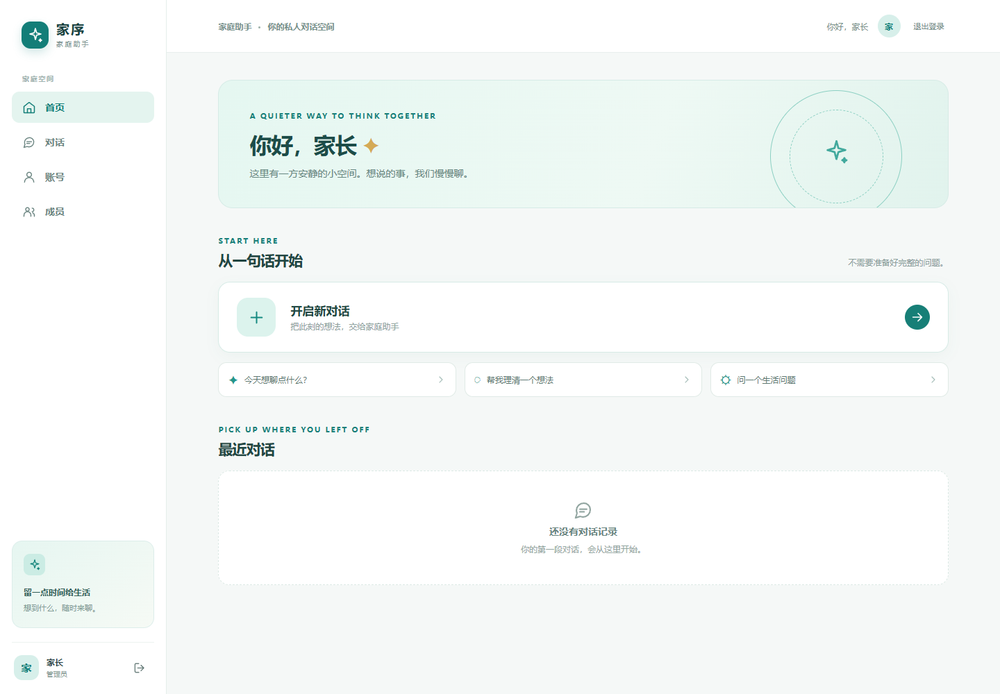
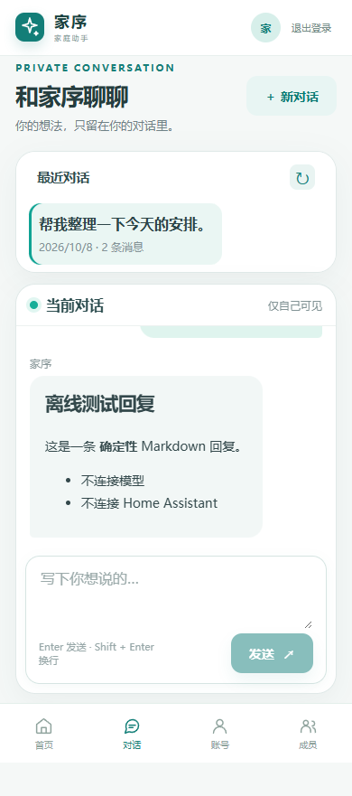

# 家庭助手前端交付记录（2026-10-08）

本轮在现有家庭控制台 Task 0–2 后端之上，交付 HTML + React + TypeScript + Vite 的中文响应式页面。主色为蓝绿色，桌面使用侧栏，手机使用底部导航。真实编译资源由既有 Go 服务提供 `/app/`；生产运行无需 Node 或外部 CDN。HA、模型、账户和会话继续留在家庭主机，云端及子域名部署保留为未来扩展。

## 可用页面

| 页面 | 已实现行为 |
|---|---|
| 登录 | 独立家庭账号、登录错误、未初始化提示、临时口令首次强制改密 |
| 首页 | 当前账户信息、开启对话、常用问题入口、本人最近历史、加载与错误状态 |
| 对话 | 发送与 Markdown 回复、历史选择、深链刷新、同账号跨设备历史、输入法与换行、生成中禁用重复发送 |
| 账号 | 修改密码、改密后重新登录、退出并清理私有页面；服务端退出失败明确提示并可重试 |
| 成员（管理员） | 创建、改显示名、启用/停用、重置口令、一次性显示临时口令 |

只具备历史权限时显示“对话记录”，保留阅读、隐藏生成入口。普通成员无法直接进入成员管理，管理员也不能查看他人聊天。同源 SharedWorker 串行协调 Cookie 写入和私有读取，写入前清理其它标签页身份并等待确认；私有请求和 WS 握手核验预期账户及 CSRF。身份变更会取消旧请求和连接，清空旧页面状态；迟到响应通过身份与会话版本校验丢弃。凭据不放入 URL 或浏览器 Web Storage；公开 SID 可用于深链，由后端继续核验所有权。

断线后的发送结果保留为“未知”，不根据旧记录里相同的问题猜测成功。先重新读取历史；读取成功后由用户选择继续，或把上一条预填后手动发送。读取失败时仅允许再次核对。页面不会自动重发或触发 HA 动作。没有收到服务器 SID 时，人工重试会清掉未经证实的本地气泡，避免新会话显示两条重复记录。

## 编译与预览

源码：`go-agent/web/`。本轮构建使用 Node 24.16.0、npm 11.13.0、Go 1.26.4，依赖版本由 `package-lock.json` 锁定。

```sh
cd go-agent/web
npm ci
npm run build
```

产物：`go-agent/static/console/index.html` 及本地哈希 JS/CSS。编译产物和依赖目录不纳入 Git，CI 从源码重建。正式运行需保留 `static/console/`，并按 [本地初始化说明](../go-agent/docs/console-local-setup.md) 设置账户目录、控制台开关和与浏览器一致的 Origin。

临时离线预览（真实 Go 鉴权、Cookie、CSRF、WebSocket 和存储，回答由测试 chain 生成）：

```sh
cd go-agent
go run ./tests/consolefixture -port 18081
```

打开 `http://127.0.0.1:18081/app/`。临时账号 `owner`、`alice`、`bobby` 的口令为 `fixture-password-123`，仅供此回环 fixture 使用。数据在临时目录，退出清理；不读取真实配置、不连接 HA 或模型。完整步骤见 [前端 README](../go-agent/web/README.md)。Vite 开发服务用于界面热更新，登录和 WS 验收使用 Go 编译入口；同源开发代理尚未纳入本轮。浏览器需要支持 SharedWorker，协调不可用时停止请求并提示；本轮实际浏览器验收使用 Chrome。

## 实际渲染

截图来自编译页面和临时测试账户，不是设计稿，也不含真实家庭数据。





其他截图位于 `docs/assets/family-console/`：桌面登录与对话、手机首页与成员管理。

## 验证结果

| 验证 | 本轮实际结果 |
|---|---|
| 锁文件重装 | `npm ci --offline` 成功，安装 209 个包；不等同于线上安全审计 |
| TypeScript、Vitest | 类型检查通过；7 个文件、47 项测试通过 |
| Vite production build | 成功生成 HTML、JS、CSS；JS 463.25 kB / gzip 143.52 kB；Worker 与编译 JS 语法检查通过 |
| Playwright + 真实 Go fixture | 本机 Chrome 11/11 通过（根代理最终复跑 12.2 秒）：7 项认证时序/退出恢复场景及建成员→首次改密→重登、成员拒绝、双账号隔离、同账号跨设备历史与深链、390px/1440px 布局和手机连续四轮滚动 |
| 页面截图检查 | 登录、首页、对话、成员页面无横向溢出、运行时或 CSP 报错 |
| Go 全套测试 | Windows 12 个有测试的包全部通过；其余 3 个包无测试文件 |
| Go vet / build | Windows 与 Linux 均通过 |
| Linux / CGO race | `go test -race ./... -count=1` 全套通过（无网络容器、缓存模块） |
| 既有前端与 Python | 旧聊天组件行为 5/5 与 JS 语法通过；Python 离线 fixture 14/14 通过 |

CI 已加入锁文件安装、类型检查、单测、生产构建及 Chromium 真实 Go fixture 测试；本轮未运行远端 GitHub Actions，不能把本机通过称作远端 CI 已通过。

独立审查按任务区分需求符合度和代码质量。基础页面、静态服务及聊天任务复审均通过；最终整体独立复审的需求符合度与代码质量均为 PASS。最终审查者另亲自复测认证/协调 13/13 通过，并核对根代理 47/47 单测与 11/11 真实浏览器原始日志。

## 失败到修复的证据

| 步骤 | 暴露的问题及修复 |
|---|---|
| 基础页面 | 撤销后的写操作 401 仍保留身份、只读历史入口、Node 范围与锁定依赖不一致；补当前身份清理、能力入口与版本约束。登出/改密的所有未完成 Cookie 清除请求结束后才允许新登录，避免迟到响应覆盖新登录 |
| 静态与 fixture | 路径检查到打开之间可能切换符号链接；使用 `os.Root` 和目录身份检查限制访问。fixture 原有一条真实 embedding 通路；替换所有模型网络依赖，测试从失败到通过 |
| 私人对话 | 服务器 SID 更新导致过早关闭 WS；使用内部路由标记。恢复时旧同文问答被误判为成功、历史失败仍允许重试、只读页仍有生成提示；保留未知状态并限制人工恢复。手机长回复滚动未到底；修改滚动策略并通过四轮实测 |

最终整体审查曾真实复现跨标签页迟到退出清除新 Cookie、登录 Cookie 先到而正文晚到导致旧身份读新数据，以及退出错误被吞。当前修复通过本地测试代理控制真实 Go 响应时序；代理不属于产品，不添加生产测试接口。页面请求仍经过真实 Cookie、CSRF 与后端所有权检查，未用 mock 数据替代家庭功能。协调 worker 的固定路径不缓存，CSP 只允许同源 worker；相关 Go 用例已从失败到通过。根代理最终重新执行类型检查、47 项单测、生产编译和 11 项真实浏览器测试，全部通过。取消或离开页面不会遗留 WS 握手处理锁，重连保留正确身份代次；退出遇到 503 保留失败状态，只有真实 401 才认定旧会话已撤销。

新增第 7 项认证场景首次触发测试账户的真实 429 登录限流；保留失败记录，将不依赖该账户数据的退出恢复场景改用另一已有测试账户后重启临时服务，全套通过，未放宽限流。SharedWorker 请求不进入页面响应拦截，因此测试使用真实本地代理，并在准备私有内容时验证后端确已保存，避免把界面气泡当作保存证据。

测试日志、逐任务报告与独立审查证据保存在附加工作区 `.superpowers/sdd/2026-10-08-family-console-frontend/`。原 P1/P2 和 Task 0–2 修改均保留，未混合提交、推送或合并。

## 每步八荣八耻检查

| 原则 | 基础页面 | 静态入口与 fixture | 私人对话与验收 |
|---|---|---|---|
| 查档求证 | 核对真实鉴权/成员 DTO | 核对 Go 路由、Origin 与文件 API | 核对 WS 帧、SID 与历史接口 |
| 对齐需求 | 独立账号、成员角色、中文布局 | Go 同源、本地优先 | 本人历史、390/1440 布局 |
| 请示规则 | 沿用已批准的角色与改密规则 | 云部署仍为后续扩展 | 不猜未知结果、不改变所有权 |
| 复用存量 | 复用 console API | 复用 Go 服务和临时后端存储 | 复用鉴权、会话与 Markdown 库 |
| 完备测例 | 身份更新、迟到响应、权限错误 | 路径、CSP、网络隔离 | 单测、真实 Go 浏览器闭环、旧回归 |
| 恪守规范 | 不改业务架构 | 只增加静态接线与测试入口 | 不新增生产测试端点 |
| 坦诚存疑 | 错误真实显示 | 临时 fixture 不代表现场验收 | 未知保留，CI/现场未运行如实记录 |
| 分步迭代 | 失败测试→修改→独立复审 | 安全问题逐项修复复审 | 聊天修复与最终组合检查 |

## 尚未交付的功能

- 共享知识授权、检索与页面（原 Task 3）。
- 家庭设备快照、管理员建议绑定/确认及页面（原 Task 4、7）；已有内部 HA 能力不能直接当作家庭前端能力。
- 原 Task 8 的完整家庭业务和现场验收：真实设备动作、断 WAN 恢复、家庭主机部署及备份操作等。
- 公网域名、云服务器、穿透或远程发布；本轮没有部署。

前端范围与执行依据见 [本轮计划](superpowers/plans/2026-10-08-family-console-frontend.md)。
