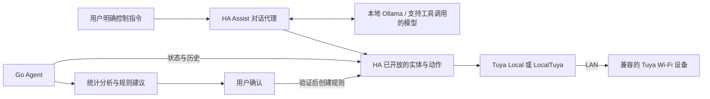

# 本地大语言模型、Home Assistant 与 Tuya 局域网接入补充规划

日期：2026-09-28。状态：资料核验与实施规划，尚未进行真实设备验收。

具体本地操作与后续任务见 [部署与开发计划](../plans/2026-09-28-local-deployment-and-next-steps.md)。依照 CONSTITUTION S-5，HA 原生 Assist 首阶段只用于只读验证；下图展示技术能力，并不授权绕过人工确认。生产写操作须接入服务端校验及人工确认流程。

## 1. 原规划是否包含这条控制链

原 [Phase 4 设计](2026-07-01-phase4-smart-home-automation-design.md) 包含 HA 设备控制、历史分析、人工确认后创建自动化；双渠道总设计包含本地 Ollama。**两者尚未组成明确的“自然语言 → 本地模型 → HA 动作 → Tuya LAN”闭环。** 原设计中的 Tuya Open API / 官方 Tuya 集成采用云端接入，不能作为局域网控制已经实现的证据。

当前 Go 代码有本地推理、HA 状态/历史/服务客户端、规则分析与确认接口。分析器目前是统计规则，不是 LLM 工具调用。REST 聊天暂不支持 tools/tool_choice（明确拒绝），也没有从普通聊天自动触发 HA 的执行步骤。HA/Ollama/Tuya 的实际安装与设备兼容性仍需验收。

本次用户约束：设备暂按 Wi-Fi 评估；允许首次配网、取密钥时联网，日常查询与控制优先走局域网。不得默默回退为涂鸦云控制。

## 2. 依据 Tuya 自身接口判断可行性

结论：**部分 Tuya Wi-Fi 设备可行，不能承诺全系列可行。** Tuya 官方明确说明首次添加需联网注册，之后支持 LAN 的设备可断网控制；LAN 功能须由厂商启用。[Tuya 官方说明](https://support.tuya.com/en/help/_detail/K9tjtiy33x3qf)

TuyaOS 文档描述 UDP 发现、TCP 连接、LAN 下发 DP 与状态回报，说明本地通信是真实设备能力。该能力可被固件关闭，且设备并发连接有限。[TuyaOS LAN 文档](https://developer.tuya.com/en/docs/iot-device-dev/TuyaOS-iot_abi_lan_dev_ctrl?id=Kcogloltxvej1)

Smart App SDK 的设备模型包含 `localKey`、`lpv` 和 `dps`，并区分 Local / Internet / Auto 控制模式。Auto 允许回退云端，因此“App 能控制”不能证明断网可控。该 SDK 接口属于移动应用，不能当作现成 Go HTTP LAN API。[Tuya SDK 设备管理](https://developer.tuya.com/en/docs/app-development/device?id=Ka75wpu7o4mr8)

官方 HA Tuya 集成标注 Cloud Push，不能满足日常控制完全依赖本地网络的目标。[HA Tuya 文档](https://www.home-assistant.io/integrations/tuya/)

## 3. 优先复用的架构

HA 官方 Ollama 集成已经提供本地对话代理；设备控制仍标为实验性，需要支持工具调用的模型，并由 exposed entities 限定可访问设备。先用少量实体验收中文指令、拒绝歧义和模型可靠性；不能因模型已能聊天就认定其可可靠控制设备。[HA Ollama 文档](https://www.home-assistant.io/integrations/ollama/)

优先采用 HA 原生 Assist + Ollama 验证设备控制，复用本项目现有分析与人工确认能力。若后续要从本项目 WebChat/企业微信发控制指令，再实现受鉴权的 HA 对话桥接或受约束工具步骤；不要同时维护两套自由执行器。

## 4. HA 到设备的接入选择

| 方案 | 日常控制路径 | 初始化/维护依赖 | 判断 |
|---|---|---|---|
| 官方 Tuya 集成 | 涂鸦云 | Smart Life 账号授权 | 可用于对照检查，不作为 LAN 验收结果 |
| `make-all/tuya-local` | HA → 设备 LAN | host、device_id、local_key 与设备配置匹配；可辅助云端获取初始信息 | 优先检查是否有对应型号配置 |
| `rospogrigio/localtuya` | HA → 设备 LAN | local key 与 DP 配置；云 API 为可选辅助 | 无现成型号配置时评估，需逐 DP 验证 |

[Tuya Local 项目文档](https://github.com/make-all/tuya-local) 说明配置、协议和重新配网导致 local key 改变的限制。[LocalTuya 项目文档](https://github.com/rospogrigio/localtuya) 说明本地控制与可选云 API；配置云辅助时，启动或密钥更新仍可能访问云。这两个社区集成不是 Tuya 官方 HA 集成。

不并行启用两个本地集成占用同一设备连接。HA 在容器中运行时，应先验证 HA 到设备 IP 的连通和发现能力；容器内 localhost 只指向该容器，不自动指向宿主机 Ollama 或其他容器。

## 5. 分步落地与验收

### A. 设备清单（待实际信息）

为每台设备记录：品牌/完整型号、连接方式、固件、product_id、局域网 IP、协议版本、所需 DP、HA entity_id。设备 ID 可放私有配置；local_key、HA token 不放 Git、日志、模型上下文或知识库。不能仅依据“支持 Smart Life”推定 LAN 支持。

### B. 一台低风险设备试接入（未完成）

1. 使用已有正常配网设备取得合法本地连接资料，不重置现有设备。
2. 检查 Tuya Local 配置是否匹配；若没有，再评估 LocalTuya 的 DP 映射。
3. 在 HA UI 验证状态、明确的开/关动作与实体回读；不要用 toggle 作为重试操作。
4. 在保持局域网和 HA/Ollama 在线的情况下，断开 WAN，验证查询、开关与状态回读。
5. WAN 断开时重启 HA，设备断电重启后再验；测试延迟、离线错误、连接恢复及重复请求。
6. 记录实测结果。若设备无 LAN 功能或关键 DP 不支持，明确标记不兼容；另行讨论云端接入或设备替换。

### C. 本地模型接入 HA（未完成）

1. HA 配置 Ollama，确认请求确实到本地地址，记录使用的模型与工具支持。
2. 仅开放已验收设备；先查询，再验证“打开客厅灯”“关闭客厅灯”等明确指令。
3. 同名实体/缺少房间信息时追问，不由模型猜设备；不存在的实体、不可用状态和工具失败应如实返回。
4. 断 WAN 重复上述流程；通过 HA 实体状态确认动作结果，不能以模型说“已执行”作为成功依据。

### D. Go Agent 外部渠道控制（尚未实现）

- 区分普通浏览器匿名会话与可控制家庭设备的已授权用户；浏览器身份 cookie 本身不赋予 HA 管理权。
- 设备目录、房间别名、允许的实体/服务均来自 HA 与配置，不由模型生成可信权限。
- 模型输出结构化意图，服务端验证实体、域、动作、参数与当前状态；复用现有 HA client 和错误处理。
- 即时动作记录请求 ID、目标、结果；超时后先回读状态再决定是否重试。
- 自动化建议仍需展示完整 trigger / condition / action 并经用户确认，复用稳定规则 ID 和现有持久化流程。
- 测试未知实体、歧义、无权限、重复确认、HA 离线、断网、提示注入和状态未变化，最后再接企业微信回执。

## 6. 本轮已经完成与尚未完成

- 已修复现有 HA config_key 路径、条件丢失、建议持久化/幂等、开启时长、启动采集等程序问题；采用模拟 HA 验证。
- 已补充本地模型与 Tuya LAN 的可行性依据和实施路径。
- 未部署或改变真实 HA/Ollama 配置，未获取设备密钥、未操作设备。
- 未实现外部聊天到 HA 的新控制功能；未证明用户实际设备支持断网运行。
- Docker/Helm、事件订阅驱动采集、企业微信建议交互等旧规划缺口仍按原任务单推进。
