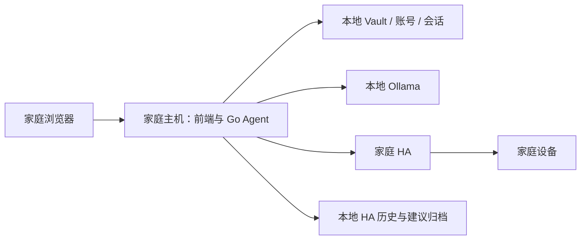

# 家庭控制台：本地部署边界与未来云扩展参考

更新与官方资料查询日期：2026-09-30。

状态：用户明确要求 HA 及相关数据留在家中，云部署暂时搁置，不再是必须要求。本文作为未来扩展参考，不构成当前采购、迁移或公网发布计划。关联：[家庭控制台设计](2026-09-30-family-console-design.md)。

## 1. 当前确定的部署范围

| 组件或数据 | 首版位置 |
|---|---|
| Home Assistant 和设备接入 | 家庭局域网 |
| Go Agent、静态前端、账号服务 | 家庭主机，单写入进程 |
| Ollama、对话和 embedding 模型 | 沿用现有本地部署方式 |
| HA Token、快照、历史、checkpoint、建议、归档 | 家庭本地持久存储 |
| 双 Vault、账号、聊天记录、向量缓存 | 家庭本地持久存储 |
| 备份 | 本地其他磁盘或家庭 NAS；不自动上传 OSS |
| 现有域名的子域名 | 保留为可选入口，启用不影响数据存储位置 |

已授权的浏览器可以展示相应设备状态和对话，但不因此在云服务器建立副本或数据库。应用仍执行主设计中的成员隔离、共享白名单与过滤。开发和 fixture 测试在当前工作站完成，实际常开家庭主机在部署时核对，不假定其操作系统或硬件。

本轮不要求购买 ECS、不修改 DNS、不启用云模型、不迁移家庭数据。此前询问的云端模型位置、地域、备案状态和预算暂不阻塞实现计划。

## 2. 本地也需要的可靠性工作

1. 账号、Vault、HA 运行资料与发布文件分开，避免静态服务暴露。备份包含 agent Vault 的 `_sessions`、各 Vault 的 `.rag-cache` 和 HA checkpoint/pending window。
2. 关键目录不可用或不可写时不进入业务就绪状态，配置失误不得静默创建空账号库或空 Vault。
3. 会话原子保存，覆盖写入中断、磁盘满和重启恢复；当前直接覆盖 JSON 的行为不能当作已验证的崩溃可靠性。
4. Windows 保持本地启动兼容，Linux 正确响应 SIGTERM；按实际目标系统提供自启和日志轮转说明，不要求用户先更换家庭主机。
5. 模型或 HA 故障时页面和已保存历史仍可访问，依赖状态和采集时间准确；现有 `/health` 仅表示进程存活。
6. 备份取得一致性边界；尚无备份锁时短暂停止应用。恢复先在临时目录验证，旧账号备份恢复后撤销登录，旧 applying/failed 规则不自动执行。

这些项目进入本地实现计划。云反代、OSS、EIP、异地隧道和云 API 适配留作后续扩展。

## 3. 未来扩展顺序

### A. 子域名与受控远程入口

真实域名未提供，`ai.<你的域名>` 仅为示例。优先评估家庭 VPN 或家庭 HTTPS 入口，仍由家中服务保存和处理数据。启用时验证实际 origin、证书、Secure cookie 和 WSS。

如果需要云服务器解决家庭无公网地址的问题，云端优先只作网络入口。可评估加密隧道转发 TLS 流量、由家庭入口终止 TLS 的方式；云端不持有 HA Token，不采集 HA 数据，不缓存聊天、知识或设备响应。实现、费用、云端可见的连接元数据届时单独审查，本轮不搭建。

云入口不能保证家中断电或断网时应用继续可用；家庭主机、电源、网络和存储的可靠性仍需单独验证。

### B. 迁移应用或模型

把 Go 采集器放在 ECS 会让设备历史和建议在云端处理或落盘，与当前约束冲突，不是默认扩展路径。应用迁移、云备份或云模型需要用户今后明确改变数据边界，再修改设计。

当前 OllamaClient 无通用云 API 鉴权，模型列表使用 `/api/tags`，旧摘要器还有固定模型 ID。如果未来使用云 embedding，参与索引的知识正文会分块发送，不只是用户提问。这些适配不加入首版本地依赖。

## 4. 已查询的阿里云规格：条件性参考

下表记录先前“完整应用迁云、模型不在该实例运行”的设想。该设想已搁置，**不是当前采购建议，也不能直接作为只做网络入口的服务器选型**。将来只做入口应按流量重新评估更小规格。

| 参数 | 原应用迁云设想的参考值 |
|---|---|
| 产品与规格 | 阿里云 ECS 通用型 g8i，`ecs.g8i.xlarge` |
| CPU / 内存 | 4 vCPU / 16 GiB，x86_64 |
| 处理器 | Intel Xeon Emerald Rapids 或 Sapphire Rapids，随机分配 |
| 主频 / 全核睿频 | 不低于 2.7 GHz / 3.2 GHz |
| GPU | 无 |
| 实例内网带宽 | 基础 4 Gbit/s，突发最高 15 Gbit/s；与公网分开 |
| 操作系统建议 | 官方 Ubuntu 24.04 LTS，64 位 x86 |
| 系统盘建议 | 50 GiB ESSD PL1 |
| 数据盘建议 | 100 GiB ESSD PL1；当前不采购云数据盘 |
| 公网建议 | 1 个 IPv4 EIP，固定 5 Mbit/s 起步 |
| 计费建议 | 常规包年包月，周期按用途和备案条件决定 |
| 地域、库存和价格 | 未确定，没有账号实时库存或最终报价 |

硬件依据：[阿里云 g8i 官方规格](https://help.aliyun.com/zh/ecs/user-guide/general-purpose-instance-families)。镜像依据：[Ubuntu 镜像](https://help.aliyun.com/en/ecs/ubuntu-image)。磁盘容量属于工程建议，容量与性能依据：[ESSD 文档](https://help.aliyun.com/zh/ecs/user-guide/essds)。没有进行当前业务容量测试。

其他已查型号：`ecs.u1-c1m4.xlarge` 为 4 vCPU／16 GiB；`ecs.gn7i-c8g1.2xlarge` 为 8 vCPU／30 GiB、1 张 NVIDIA A10、24 GB 显存。后者能否承载目标模型还取决于量化、上下文、并发和其他模型占用。来源：[U 实例](https://help.aliyun.com/zh/ecs/user-guide/general-work-force)、[GPU 实例](https://help.aliyun.com/zh/egs/gpu-accelerated-compute-optimized-instance-families)。

未来采购前重新查询官网和库存，并分别计算实例、磁盘、公网、备份和 API 费用。依据：[计费规则](https://help.aliyun.com/zh/ecs/subscription)。内地 Web 部署的备案和接入要求按 [阿里云备案说明](https://help.aliyun.com/zh/dns/pubz-filing-domain-name-related-faq) 核对，子域名不自动豁免。

## 5. 将来启用远程入口时再验收

- 只公开家庭控制台必要路径，不公开旧匿名聊天、内部管理、HA 和 Ollama 端口。
- 验证证书、HTTPS/WSS、登录、长回答、退出撤销和跨域拒绝。
- 明确 TLS 终止位置、日志与缓存范围，证明云端没有持久化 HA 内容、会话或 Vault。
- 验证家庭断网与恢复、本地独立访问、陈旧状态展示，不重复提交不确定是否成功的 HA 操作。
- 已安装规则能否断 WAN 工作仍取决于 HA 集成与设备，保留现场验收。

这些是未来启用条件，不阻塞当前前端、本地账号和业务闭环。
