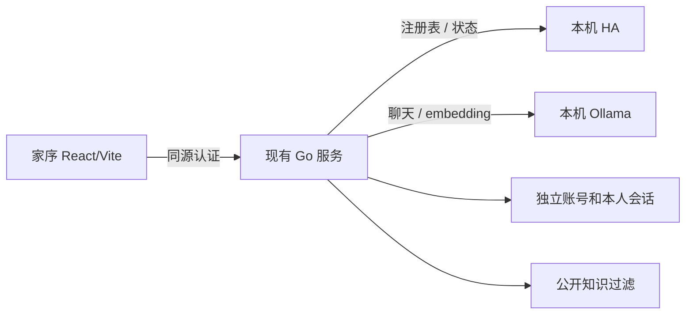

# 家庭区域页面与本机 HA / Ollama 接入设计草案

日期：2026-10-08
状态：用户2026-10-08已审阅、修正并授权执行；实际实现与验收结果另行记录。
基础：codex/p1-p2-remediation 附加工作区中已完成的 P1/P2、家庭 Task 0–2 与 React/Vite 首版；保留全部既有未提交改动。

## 1. 需求和范围

用户要求：在 HA 根据名称和标签分类区域；新增“全部区域→区域设备→设备详情”页面；网页接入本机 HA 与 Ollama；所有设计和实现遵循八荣八耻。

**已明确：所有家庭成员查看全部区域和设备。** 用户进一步明确：负一楼就是地下室；老人房厕所属于老人房；原待分类内容统一分类到其他。 这覆盖原家庭设计的设备共享白名单默认值，不扩大查看他人聊天、personal 知识、管理成员或安装自动化的权限。HA、模型、账号和数据仍留本机，云服务器与子域名不是本轮前提。

本草案采用已询问选项中的推荐范围：真实聊天、区域与设备状态展示、服务状态反馈和本次 HA 元数据分类。手动设备开关与新增自动化审核页面的范围问题尚未收到答复；草案不增加这些网页写操作。如用户选择它们，先补齐权限与确认流程。已有建议后端继续保留。

不新增 Node 生产服务、第三个 Vault、云模型、自然语言控制或任意 HA 服务代理。分类只修改区域关系，不执行开关、窗帘、场景、温度或自动化动作。

## 2. 只读调查结果

依据：本机 HA 页面、限定字段的注册表快照、现有源码与匹配版本官方接口。

| 项目 | 实测结果 |
|---|---|
| HA | ha 容器已运行；IPv4 8123 可访问，ha_local 正常页面登录成功；版本 2026.7.2 |
| 区域 | 客厅、厨房、卧室、地下室B1；地下室B1 已有别名“地下室” |
| 数量 | 74 个设备注册项、187 个实体；设备注册项含软件设备与场景，不能称为 74 台物理硬件 |
| 已有归属 | 仅地下室电梯口筒灯感应→地下室B1 |
| 标签 | UI 无标签，标签注册文件不存在；设备与实体 labels 为空 |
| 实体覆盖 | 全部实体自定义名称和 area_id 覆盖为空 |
| 用户示例 | 未发现地下室夹层设备/实体，也未发现名为地下室灯的注册设备 |
| 多路开关 | 25 台的通道原名为开关 1/2/3/4，实际负载房间无法验证 |
| Ollama | 11434 当前不可达；已安装，gemma4:12b、bge-m3:latest、llava:7b 的 manifest 与引用 blob 存在 |
| 真实控制台 | 未启动、未配置/初始化；18082 是 fixture，不能以它的回复宣称真实推理通过 |
| HA 服务端凭据 | 当前配置引用变量没有非空赋值；网页登录不替代 Go 的凭据配置 |

过滤后的完整调查仅放主工作区 .local/ha-area-inventory-2026-10-08.json 与同名 Markdown，不在公共设计中复制全部设备标识。

## 3. 推荐方案

复用 React/Vite + 单个 Go 服务。浏览器访问同源 Go；Go 使用服务端凭据读取 HA，通过已有推理客户端访问 Ollama。继续使用账号、私有会话、SharedWorker 身份协调、采集、RAG 和输出过滤。

备选一：嵌入 HA 页面，开发快，但页面与权限由 HA 决定，不能实现统一的家庭账号和区域子页。备选二：新增 Node 代理，转发灵活，但重复授权与运行环节。本轮推荐复用现有 Go，不采用两个备选。

## 4. 分类规则与候选映射

### 4.1 规则

1. 现有设备区域和实体覆盖是权威值；已有非空归属先保留，不覆盖人工分类。
2. 只使用审阅后的地点词表及标签 ID 对应的明确地点名称；用途或类型标签不等同房间。
3. 标签和名称冲突、同样具体的候选冲突、地点可能跨楼层时归到其他并说明原因。
4. 完整、更长地点名优先：地下室夹层优先于地下室。不从拼音 entity_id、编号猜位置。
5. 复用区域名称和别名：地下室→地下室B1；卧室不自动等同主卧。不先为不存在的示例设备创建空区域。
6. HA 区域没有父区域字段。地下室夹层是独立区域；区域→设备子页只是前端导航。
7. 多路开关名称仅说明控制器命名地点。可分类控制器，但不猜开关 1 的负载，不新增实体覆盖；后续有准确负载映射时才按实体覆盖处理。设备分类后，未覆盖实体会由 HA 自动继承，页面明确标注“控制器归属；负载地点未验证”，不把它描述为已经确认灯具位置。

### 4.2 实际名称对应的映射提案

这张表尚未写入 HA。更具体地点独立列出，属于本设计选择，供用户审阅。

| 名称或完整前缀 | 目标 |
|---|---|
| 客厅开关、客厅开关二、客厅空调、客厅布帘、客厅纱帘 | 客厅 |
| 厨房开关 | 厨房 |
| 地下室后门 | 地下室B1（既有别名地下室） |
| 地下室电梯口筒灯感应 | 保留地下室B1 |
| 主卧空调、主卧布帘、主卧纱帘、主卧进门三位、主卧进门二键 | 主卧 |
| 主卧厕所 | 主卧厕所 |
| 主卧电梯口、主卧电梯口感应 | 主卧电梯口 |
| 老人房空调、老人房布帘、老人房纱帘 | 老人房 |
| 老人房厕所 | 老人房 |
| 儿童房进门开关、儿童房空调、儿童房布帘、儿童房纱帘 | 儿童房 |
| 衣帽间开关、衣帽间空调 | 衣帽间 |
| 书房进门开关、书房床头开关、书房空调 | 书房 |
| 餐厅开关一、餐厅空调、餐厅布帘、餐厅纱帘 | 餐厅 |
| 车库门磁、客卫开关 | 各自区域：车库、客卫 |
| 入户口、入户门磁 | 入户 |
| 二楼公卫 | 二楼公卫 |
| 负一楼楼梯、负一楼中控、回家模式负一楼 | 地下室B1（用户明确负一楼=地下室） |
| 负二楼楼梯、一楼楼梯、二楼楼梯三位 | 各自地点：负二楼楼梯、一楼楼梯、二楼楼梯 |
| 三楼后门 | 三楼后门 |
| 三台同名阳台灯 | 其他：未证明同一阳台或各自楼层 |
| 电梯口、进门三位、三位开关 5、床头开关、床头左/右开关、卫生间起夜感应 | 其他：地点不唯一 |
| 一楼中控 | 其他：具体房间未知 |
| 04BE-B、蓝牙单路控制器 3、电视等无地点名称；软件设备和场景 | 分类到真实其他区域 |

负一楼按用户规则复用地下室B1；负二楼不自动合并。当前没有地下室夹层，不创建该空区域；匹配算法仍必须用 fixture 验证其优先级。

### 4.3 执行和恢复

分类为本机受控运维步骤，不由成员 GET 或模型隐式触发；不为一次整理新增长期管理子系统。

生成本地预览，包含 ID、原区域、目标、匹配来源（现有别名/设备名称/实体名称/明确地点标签）及跳过原因。实际执行只采用本表中明确的设备名称和既有归属；未知通道名称不触发实体覆盖。预览检查已有自动化、脚本或场景中的 area-target 引用，列出目标集合变化；无法核对的影响标记未验。本次不执行动作或修改自动化文件，不等于其未来运行时目标集合不受影响。每条写前重读原归属，变化则冲突跳过。创建先查已有名称/别名，使用返回的 area_id；已经等于目标则跳过。只发送区域字段，不发送 labels、名称、disabled_by 或其他字段。

逐项写、逐项读回；HA 没有整批事务或 revision/CAS，不保证读写间没有其他管理员修改，执行期间应避免并行编辑。断线先读回核对，不盲目重复创建。保存原值，恢复时也核对当前值以免覆盖后来的人工操作。报告成功、跳过、冲突、失败及未知结果。

## 5. 外部契约与区域目录

### 5.1 查证的 HA 2026.7.2 接口

在已认证 /api/websocket 连接发送：

| 命令 | 最小字段 | result 要点 |
|---|---|---|
| config/area_registry/list | id、type | 区域数组，ID 是 area_id |
| config/device_registry/list | id、type | 设备数组，ID 是 id |
| config/entity_registry/list | id、type | entity_id、device_id、area_id 等，无状态值 |
| config/label_registry/list | id、type | 标签数组，ID 是 label_id |
| config/area_registry/create | id、type、name | 新区域对象，使用返回的 area_id |
| config/device_registry/update | id、type、device_id、area_id | 设备对象 |
| config/entity_registry/update | id、type、entity_id、area_id | 包含 entity_entry 的对象 |

list 需要已认证连接；三个写操作需要 HA admin。实体 area_id:null 清除覆盖并继承设备区域。命令 ID 为连接内递增正整数，检查响应 ID、type、success。复用既有 wsAuth，新增请求封装不改变事件订阅；取消关闭连接，读写有界超时。错误不透传 Token 或 HA 原文。

registry 用独立读取类型，允许忽略无关新增字段；nullable 正确处理，Unix 时间不误解为 RFC3339。状态从既有 GET /api/states 按 entity_id 合并，registry 存在不意味着在线。

依据：[WebSocket 文档](https://developers.home-assistant.io/docs/api/websocket/)、[版本区域接口](https://raw.githubusercontent.com/home-assistant/core/2026.7.2/homeassistant/components/config/area_registry.py)、[设备接口](https://raw.githubusercontent.com/home-assistant/core/2026.7.2/homeassistant/components/config/device_registry.py)、[实体接口](https://raw.githubusercontent.com/home-assistant/core/2026.7.2/homeassistant/components/config/entity_registry.py)、[标签接口](https://raw.githubusercontent.com/home-assistant/core/2026.7.2/homeassistant/components/config/label_registry.py)。

### 5.2 数据语义

目录读取所有必要 registry 和状态，全部成功后发布完整内存快照；不推进历史 checkpoint，不执行分析和写操作，保留历史采集间隔。HA 各次读取本身不是事务快照，目录不得假称具备原子上游 revision。

按设备注册 ID 归组，switch 通道不算新设备。实体有效区域：实体显式 area_id → 设备 area_id → 其他；非空但未知的区域 ID 保留异常关系并进入其他，不悄悄改为继承。区域设备集合固定为“设备直接归属此区”与“此区有效实体所属设备”的并集，卡片标记直接归属/实体覆盖/两者都有。区域实体数仅统计有效区域属于此区的实体。独立实体单列；设备无实体仍保留卡片；所有真实区域包括空区域均显示。

实体覆盖使设备跨区时，每区仅展示属于该区的实体：设备直接在 A、全部实体覆盖到 B，A 保留控制器卡并提示实体另属区域；设备没有直接区域、实体均已覆盖，其他保留控制器卡但不重复显示其他区实体。全屋设备总数按注册 ID 去重，独立实体单独计数，不把区域计数相加。软件设备和场景保留，不宣称都是物理硬件。禁用、隐藏、unavailable、无当前状态分别展示。

其他是实际HA区域，分类时创建/复用并把原无归属设备和独立注册实体分类到它；目录遇到未来无归属数据也显示其他，真实其他存在则使用该区域ID，不能另造第二张其他卡。

路由 ID 固定为：真实区域 a_ + 原 area_id 的 UTF-8 无填充 Base64URL；合成其他入口 u_other；设备 d_ + 原 device_id 的同类编码；独立实体 e_ + entity_id 的同类编码。解码只接受规范编码，拒绝空值、非法 UTF-8、未知类型及不在当前目录中的 ID；这些 ID 不是授权凭证或文件路径。独立实体详情复用设备详情路径但以 kind=entity 明确区分，注册设备为 kind=device。每个详情再次核对区域关系，错误组合 JSON 404；页面仍可显示 entity_id。

合并并发刷新，成功目录缓存最多 30 秒，上游总超时 10 秒。共享刷新由服务生命周期与该超时控制，单个请求取消只退出自身等待，不取消其他调用的刷新。首次读取失败无目录返回 503；已有目录后失败返回完整旧快照并标 stale/失败状态，保留旧 observed_at，不把失败时间当采集时间，不返回局部新数据。目录元数据明确包含 last_attempt_at、last_success_at；observed_at 是最近完整成功目录时间。freshness=fresh 需最近读取成功且距 observed_at 不超过30秒，失败或超龄为stale，无快照为unknown。状态卡与区域页使用同一HA检查语义，不能一处失败另一处仍称当前已连接。下一次成功刷新反映元数据变化。

家庭 DTO 只投影必要字段：ID、名称、关系、数量、实体域、状态、单位、last_changed、last_updated、禁用/隐藏状态、数据时间、检查时间及连接状态。state、unit、last_changed、last_updated 明确可为 null，无当前状态时不以空字符串或零时间冒充已知值；无单位亦为 null。不透传原 attributes、注册表中的 MAC/IP/连接标识/配置条目、Token、HA 地址、绝对路径或原始错误。

### 5.3 拟新增家庭 API（尚未实现）

- GET /api/console/v1/areas：真实区域、其他入口、全屋去重统计、目录时间/状态。可选 q（最多128个字符）按区域/设备名称及 entity_id 搜索；响应区分全屋数量与匹配数量，返回匹配设备的安全摘要，不因过滤改写全屋统计。
- GET /api/console/v1/areas/:areaID/devices：区域设备投影与独立实体组。
- GET /api/console/v1/areas/:areaID/devices/:deviceID：该区域下设备详情与实体状态。
- GET /api/console/v1/integrations/status：HA/Ollama 最近检查和配置模型是否存在；不返回凭据、endpoint 或任意探测 URL。

复用既有认证、预期身份校验、no-store 和安全错误格式。已改密的有效 admin/member 均有 areas:read；不使用 EntityIDs 共享白名单过滤设备。匿名、未改密、禁用、过期仍拒绝；已有建议共享规则不变。服务检查缓存 30 秒、超时有界，不发真实模型生成或设备动作。

## 6. 前端

沿用家序视觉、CSS、React Router、fetch 与身份协调器：

- 桌面新增家庭；手机主要导航为首页、对话、家庭、账号，管理员成员管理保留在账号管理入口，避免底栏挤满。
- /app/areas：区域卡片、数量、其他、按名称/实体 ID 搜索、HA 状态和数据时间。
- /app/areas/:areaID：面包屑、设备卡片、域筛选、独立实体。
- /app/areas/:areaID/devices/:deviceID：设备/区域关系、各实体名称、状态、单位、更新时间；配置/诊断实体折叠但存在可见。
- 首页补家庭摘要与服务状态。真实聊天继续原页面，不另造聊天引擎。
- 加载、空区域、无目录、断连、旧数据、模型缺失与404有文字提示和重试，不用虚构卡片。
- 可见每 30 秒刷新，隐藏暂停。请求用 AbortSignal/epoch；退出/切账号取消并清空，迟到响应不能写入新账号。设备资料不写 WebStorage/Service Worker。
- Go SPA 白名单只增加这些合法路由；未知资源/API仍404，不都返回HTML。验收子页直接打开/刷新、手机返回和键盘操作。

已连接只代表最近检查成功，tags 中有模型只代表安装。真实生成和检索验收前不显示“全部已验证”；last_changed 不用于推断设备离线。

## 7. Ollama 与必要隐私边界

复用 inference.OllamaClient、Agent、RAG 与输出过滤；浏览器不直连 11434，不放宽 CORS/CSP。沿用 /v1/chat/completions、/v1/embeddings、/api/tags。
依据：[Ollama 兼容接口](https://docs.ollama.com/api/openai-compatibility)、[模型列表](https://docs.ollama.com/api/tags)。

用户已重启本机 Ollama，实施时复查可达性和配置模型，再用一次非敏感中文问答验证实际生成；临时公开资料中的唯一事实验证内容实际进入模型上下文。不自动下载替代模型；缺失/失败如实报告。文字页不加入图片或语音功能。

**真实接入前落实原家庭设计第5节的 HA 运行目录隔离。** 在 reader/索引建立前解析 Vault 与智能家居运行目录关系，覆盖公开检索、向量候选、旧缓存重载、实体触发、正文复读和最终模型上下文；合法公开资料仍可用。新 RuleDocument 标注 internal；策略保护已有归档，不批量重写用户内容。

运行目录等于整个 Vault、关系不安全或校验失败时拒绝相关初始化，不先加载再过滤。此项只是家庭聊天必要边界，不扩展成知识搜索/导入/发布 UI。成员仍不能访问 personal 或他人会话。

## 8. 本机运行

使用附加工作区编译产物，独立运行配置和 console 数据目录，通过既有内部 bootstrap 初始化真实管理员。fixture 账号不迁移生产。HA/Ollama用IPv4回环；Go显式回环监听并配置匹配public_origin；本轮不宣称公网/局域网HTTPS已验收。

管理密钥与HA凭据只在本机服务端配置/环境，不放前端、URL、参数或日志。HA通过正常授权流程取有效凭据，不覆盖或注入 .storage/auth，不运行旧恢复脚本。若需要创建新的长期管理凭据，实施时明确用途/权限并完成必要的具体授权。

HA失败不阻止读取已有个人历史；Ollama失败不阻止区域页。停机取消并收尾。运行说明分别记录构建、模拟、真实接口、现场动作结果。

## 9. 分步验收和八荣八耻

每步失败用例→最小修改→通过证据→独立审查。编译和模拟完成后，才进行真实只读接入及区域元数据执行。

| 阶段 | 验收 |
|---|---|
| 基线/隐私 | 保留用户改动；运行目录旧缓存、损坏metadata、personal唯一事实不进模型；公开资料可用 |
| HA契约 | auth/result/id/错误/取消；ID字段、null、新字段正确；不泄露原始上游错误 |
| 分类 | 长词/别名/冲突/既有归属/歧义/通道不猜；记录控制器继承与area-target影响；重复零多余创建；部分失败读回；人工变化冲突 |
| API | admin/member全量读，匿名/未改密/禁用拒绝；去重、继承、覆盖后控制器卡、独立实体、nullable、空区域；规范ID与未知组合404；DTO无敏感字段；一请求取消不影响另一等待 |
| React | 层级、深链刷新、搜索、折叠、手机、键盘、旧数据、身份切换迟到响应；真实Go fixture浏览器测试 |
| 本机 | tags、真实中文回答、唯一事实RAG、HA只读接口、真实账号独立、重启恢复本人历史 |
| HA执行 | 每项写后读回，报告成功/跳过/冲突/失败；分类不修改名称、entity_id、labels、设备状态和自动化 |

最终运行Go全套test/vet/build、前端typecheck/test/build/编译JS语法/浏览器行为、旧挂件、Python离线fixture、diff；Linux/CGO运行race，按实际结果记录。

八荣八耻检查：
- 查档求证：匹配HA 2026.7.2，拟新增API不冒充现有接口。
- 对产需求：全家可读、页面层级、真实接入与现场结果分别定义。
- 请示规则：不猜楼层、通道、presence或控制权限，歧义保留。
- 复用存量：沿用Go、React、认证、采集、推理和过滤。
- 完备测例：验证权限、正确性、失败、取消、缓存和实际模型上下文。
- 恪守规范：不暴露HA管理凭据和任意服务代理。
- 坦诚存疑：磁盘模型、网页登录、接口连通不等于现场动作成功。
- 分步迭代：每步可验收，不整体替换网关、会话和知识架构。

仍需现场验证：真实房间/楼层、各通道负载、设备动作与传感器物理变化、断WAN和家中网络恢复。本轮只读和模拟不替代这些结果。
