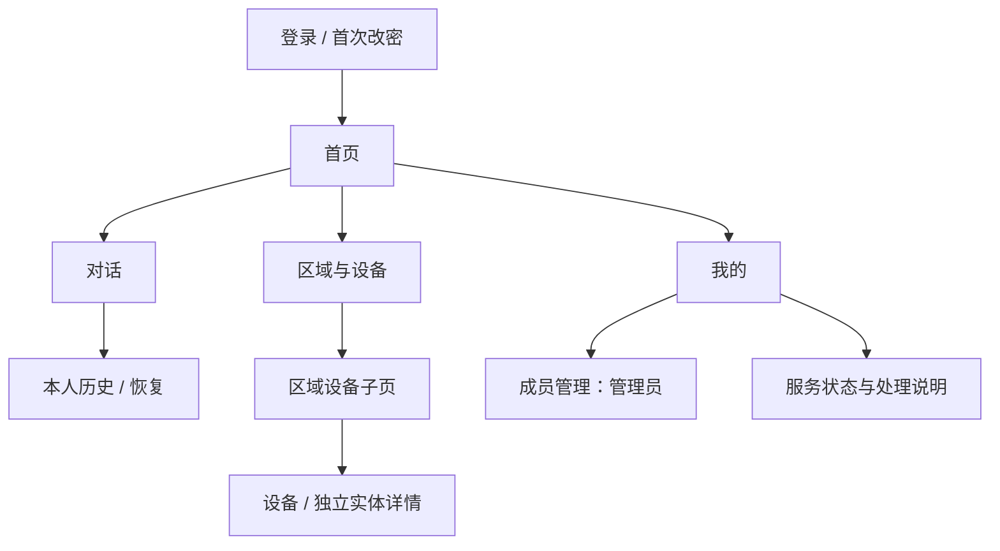
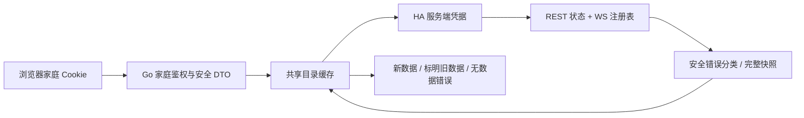

# 家序前端整体修订设计方案（2026-10-08）

状态：完整审阅稿，尚未进入实现。本轮只进行了诊断、官方资料核对和设计文档编写，没有修改产品源码、正式配置或区域归属。视觉方向暂按“简洁清晰、适合全家”设计；后续偏好回复可调整视觉层，不改变权限规则。

## 1. 目标与边界

服务对象是用户和家庭成员，包括不熟悉 HA、实体或模型术语的成员。成功标准是：能登录、能分清服务故障与账号故障、能找到区域与设备、能准确阅读状态、能安全进行本人聊天和管理员账号操作。

继续使用 HTML + React + TypeScript + Vite，由既有 Go 服务提供同源页面。HA、模型、账号和家庭资料留在本机；云服务器、域名和子域名仅保留未来扩展。所有有效且完成首次改密的家庭成员可读全部区域和设备。成员不能读取他人聊天；管理员同样不能借管理权限浏览他人聊天。

此次设备页面保持只读，不新增开关、窗帘、场景、自动化或报警动作。既有人工确认、权限隔离、RAG 隐私过滤、会话并发和取消规则保留。更换图标不得暗示已提供设备控制，也不得再次自动调整 HA 分类。

## 2. HA 连接失败：已确认的原因

2026-10-08 北京时间 18:40，核对的是真实 18083 服务，不是 18082 模拟预览：

| 观察 | 结果与含义 |
|---|---|
| 正式 Go 进程 | PID 与保存的执行文件路径一致，服务正在运行 |
| 家庭账号正常登录 | 成功取得 Cookie；登录系统本身有效 |
| HA 网页 | 浏览器中既有 ha_local 登录可进入；这不是后台服务凭据 |
| 后台 HA 凭据 | normal_oauth_temporary，access token 已于 18:06:31 到期 |
| 相同 token 请求 HA /api/ | HTTP 401，证明服务可达但拒绝这份授权 |
| 家庭集成状态 | HTTP 200，HA unavailable / stale / ha_unavailable |
| 区域读取 | HTTP 200，21 个区域；数据时间仍为 17:43:28，是保留的旧快照 |
| Ollama | connected，配置模型可查询 |

18:42 的单变量验证：用既有正常 refresh grant 取得一个 1800 秒的临时 access token，同一个 HA /api/ 立即返回 200。探针 token 仅在内存使用并丢弃，没有写入正式配置，没有重启服务，也没有创建长期凭据。因此，本次正式后台连接尚未修复。

代码链路：Bootstrap 把配置 token 保存进 HA client；REST Bearer 和注册表 WebSocket 使用该静态值。当前客户端没有 expiry 管理、token 更新或自动 OAuth refresh。页面登录、目录轮询和“刷新状态”都不会更新 HA token。可核对 [client.go](../../../go-agent/internal/smarthome/client.go)、[ws.go](../../../go-agent/internal/smarthome/ws.go)、[catalog.go](../../../go-agent/internal/smarthome/catalog.go) 和 [前端状态展示](../../../go-agent/web/src/HomeFamilySummary.tsx)。

结论：本次是后台短期凭据到期，加上应用尚未实现续期，并非家庭登录错误，也没有证据支持把它归因于本次 HA API 网络不可达或 CORS。HA 官方说明 access token 是短期凭据，可使用 refresh token 换取新 access token；无效访问令牌返回 401。[HA Authentication API](https://developers.home-assistant.io/docs/auth_api/)

现有保留旧目录的行为正确；问题在于“HA 暂时无法连接”没有告诉用户授权失效。不能通过重新登录家庭账号、频繁点击刷新或重启未更换凭据的服务解决它。

## 3. 现有设计审查

现有页面具备清楚的主操作、文字导航、输入标签、Cookie 边界、原生弹窗、面包屑和失败保旧机制，这些继续复用。以下问题需要修订：

| 优先级 | 问题 | 修订方向 |
|---|---|---|
| 必须先处理 | 短期 HA token 被当作静态服务凭据 | 明确凭据模式，完成稳定服务授权与到期/撤销验证 |
| 高 | HA 授权、网络、权限错误均显示通用不可用 | 传播安全分类，给不同用户正确的下一步 |
| 高 | 聊天头部固定绿色点 | 去掉不依赖真实状态的在线暗示 |
| 高 | 所有实体 on/off 都译为开启/关闭 | 按 domain 和安全 device_class 显示，未知语义保留原值 |
| 高 | 辅助文字、时间、底部导航部分色对过淡 | 更换设计 token，验证实际页面对比和文字放大 |
| 中 | SVG 与 ＋、↻、↗、✦ 等字符混用 | 一个图标系统，同一动作保持相同图形 |
| 中 | spark 同时代表品牌、AI 和独立实体 | 限定语义；独立实体使用数据节点标志 |
| 中 | 区域都使用整屋图标，设备又使用区域四格 | 区分区域、设备、实体三个层级 |
| 中 | HA/Ollama 共用来自 Ollama 的检查时间 | 每个服务分别显示自己的检查时间 |
| 中 | Ollama 无法检查时仍把 available=false 显示为未安装 | “无法确认”与“已确认未安装”分开 |
| 中 | 英文装饰、欢迎插画占据首页主要位置 | 家庭状态和常用入口优先，装饰退居次要 |
| 中 | 刷新、关闭等触控目标偏小 | 产品目标至少 44×44 CSS px |
| 中 | “实体域、注册项”等技术术语占主层级 | 使用中文入口，保留准确解释与原始标识的展开区域 |

部分旧色对约 2.2–3.1，来自 CSS 静态计算，不是对整个网站的 WCAG 认证结论。完整逐页面/动作证据保存在 [图标审计](../../../.superpowers/sdd/2026-10-08-family-areas-live-integration/design-revision-2026-10-08-icon-audit.md) 和 [HA 源码诊断](../../../.superpowers/sdd/2026-10-08-family-areas-live-integration/design-revision-2026-10-08-ha-code-diagnosis.md)。

## 4. 方案比较与推荐

| 路线 | 内容 | 优点 | 代价 |
|---|---|---|---|
| A：保留品牌，系统修订（推荐） | 保留“家序”和浅色绿系；统一图标、字号、状态与四个主入口，调整首页优先级 | 复用现有 React、身份与目录流程；全家容易理解；修订范围可控 | 需要逐页更新组件与回归 |
| B：最小纠偏 | 只修授权错误、字符图标、对比和触控 | 开发成本最低 | 首页仍偏聊天装饰，区域/设备层级改善有限 |
| C：专业设备控制台 | 首页改成密集设备仪表盘，更多技术状态与深色面板 | 熟悉 HA 的管理员查数据方便 | 不适合全家作为默认入口，容易暗示尚不存在的控制功能 |

推荐 A。当前功能本身不要求大屏驾驶舱或重写前端；重点是准确的信息与清楚的操作，不要求每一块内容都配图标或卡片。

图标实现建议保留现有 Icon 包装接口，采用一个固定、经过核对的 Lucide SVG 图形集。默认使用 lucide-react 的显式导入；它支持独立 SVG 组件和按导入裁剪。不加载远程图标/CDN，不动态导入 HA 返回的任意图标字符串。实施前核对项目实际 React/TypeScript 版本和包导出，并锁定版本；本轮没有安装依赖。[Lucide React](https://lucide.dev/guide/react)

若部署要求维持零新增依赖，可将同一批准图形集作为本地 SVG 保留在既有 Icon 中；不混搭不同套图形。分发时保留 Lucide 的 ISC 及涉及 Feather 衍生图形的 MIT 许可说明。[Lucide License](https://lucide.dev/license)

## 5. 信息架构与页面层级

电脑与手机使用相同的四个主入口：

| 入口 | 页面/路由 | 主用途 |
|---|---|---|
| 首页 | /app/ | 家庭设备服务、AI 服务概况、常用入口和最近本人聊天 |
| 对话 | /app/chat | 新对话、本人历史和恢复 |
| 区域与设备 | /app/areas | 全部区域，继续进入区域设备子页 |
| 我的 | /app/account | 身份、密码、退出；管理员进入成员管理和服务说明 |

手机底栏短标签为“首页 / 对话 / 设备 / 我的”；设备页标题为“区域与设备”。成员管理继续使用 /app/members，集中在“我的”下，避免管理员和成员看到不同数量的主导航。保留旧深链，权限继续由 Go 判断。

全屋去重统计与搜索结果统计分开显示。设备、实体和独立实体分别表达，不将通道当作新设备，不把软件注册项描述为物理设备。存在跨区实体覆盖时在详情说明，保持“负载地点未验证”。

## 6. 统一视觉规范

| 项目 | 设计值 |
|---|---|
| 页面背景 / 表面 | #F6F8F5 / #FFFFFF |
| 主文字 / 次文字 | #20352F / #53655E |
| 品牌主色 / 选中背景 | #176B5B / #E9F3EE |
| 警告文字 / 背景 | #7A4C00 / #FFF5DB |
| 错误文字 / 背景 | #9F2D2D / #FFF1F0 |
| 提示文字 / 背景 | #245D83 / #EEF6FC |
| 字体 | 系统中文无衬线；不请求外部字体 |
| 正文 / 说明 / 导航 | 16 / 14 / 14 px；有用信息不再使用 10 px |
| 标题 | 桌面 h1 30–32 px，手机 26–28 px，章节 20–22 px |
| 行高 | 正文 1.5–1.6；长设备名允许换行 |
| 间距 | 4 / 8 / 12 / 16 / 24 / 32 px |
| 圆角 | 输入与按钮 10 px；卡片 14 px；避免不同卡片随机变化 |
| 图标 | 24×24 网格，动作 20 px、导航 22 px、卡片 24 px、空态 32–40 px；统一 2 px 圆端描边 |
| 触控目标 | 常用按钮与图标按钮至少 44×44 px，手机输入高度 48 px |
| 焦点 | 2 px 可见品牌环，2 px 间隔；不能被吸底栏遮住 |
| 动效 | 状态过渡 120–180 ms；仅等待时转动 loader，遵守 reduced-motion |

拟定色对已计算：主文字/白 13.03，次文字/白 6.19，主按钮白字/主色 6.38，选中导航 5.63，警告 6.76，错误 6.61。实施后仍须按实际 computed style、状态和背景核验，不能把设计色表当成页面已通过。

普通文字至少 4.5:1、必要界面图形至少 3:1，按 W3C 的对应标准验收。[文字对比](https://www.w3.org/WAI/WCAG22/Understanding/contrast-minimum.html)、[非文字对比](https://www.w3.org/WAI/WCAG22/Understanding/non-text-contrast.html)

44 px 是本产品面向家庭的易用目标。WCAG 2.2 AA 的目标尺寸最低条款为 24 px，并包含间距等例外，不能把旧 28 px 按钮直接一律判为 AA 失败。[目标尺寸](https://www.w3.org/WAI/WCAG22/Understanding/target-size-minimum.html)

桌面侧栏 224 px、内容最大宽度 1120 px；手机页边距 16 px、平板 24 px、桌面 32 px。内容区域不足 600 px 时目录一列，600–999 px 两列，1000 px 起三列；这些是可用内容宽度，不是仅设备屏幕宽度。聊天采用独立可伸缩布局。验证 320 / 390 / 768 / 1440 px 以及 200% 文字放大，无横向溢出或被遮挡的操作。

## 7. 图标语义与使用规则

每个图标只有明确的对象或动作语义。同一个图形可以在同一语义下复用；不要求“每个房间都有独特图案”。品牌图案可以保留一次，不能作为设备类型或服务健康状态。

| 使用位置 | 图标语义 / 推荐图形 | 可见文字或可访问名称 |
|---|---|---|
| 品牌 | 现有品牌标记，可保留 spark | 家序；纯装饰 SVG 隐藏于辅助技术 |
| 首页导航 | house | 首页 |
| 对话导航、会话行 | message-circle | 对话 / 会话名称 |
| 区域导航、全屋摘要 | layout-grid | 区域与设备 / 全部区域 |
| 我的 | user-round | 我的 |
| 成员管理 | users | 成员管理 |
| 登录提交 | log-in，可不额外加图标 | 登录 |
| 密码、隐私说明 | lock | 修改密码 / 仅自己可见；不声称已加密全部磁盘资料 |
| 新对话 | plus | 新对话 |
| 发送 | send | 发送消息；不使用表示外跳的 ↗ |
| 历史 | clock 或 message-circle | 最近对话 |
| 检索 | search | 搜索区域、设备或实体 |
| 筛选 | funnel | 设备类型 |
| 进入下一级 | chevron-right | 区域名 / 设备名；随链接文本提供名称 |
| 返回 | arrow-left | 返回区域 / 返回全部区域 |
| 外部跳转 | external-link | 明确写出目的地，仅用于真正外链 |
| 刷新读取 | refresh-cw | 检查状态 / 刷新对话列表 |
| 结果未知核对 | refresh-cw + 明确文本 | 再次核对历史 |
| 重试上一条 | rotate-ccw + 明确文本 | 重试上一条；不与“继续、不重发”合并 |
| 加载 | loader-circle | 正在读取 / 正在检查 |
| 成功 | circle-check | 最近检查成功；不等于设备全部在线 |
| 授权失效 | lock + 警告样式 | HA 授权失效 |
| 权限不足 | shield + 错误说明 | HA 权限不足 |
| 连接失败 | triangle-alert | 无法连接家庭设备服务 |
| 状态未知 | circle-question-mark | 尚未检查 / 暂无法确认 |
| 旧数据 | clock | 数据截至具体时间 |
| 提示 | info | 区域归属与负载地点说明 |
| 普通区域卡 | map-pin 或统一区域标记 | 区域名称 |
| 其他区域 | layers | 其他；不显示“待分类” |
| 普通设备注册项 | 通用设备框/芯片图形 | 设备；详细说明“设备注册项” |
| 独立实体 | 数据节点/信号图形 | 独立实体 |
| 灯、风扇等实体 | 明确 domain 的灯泡/风扇语义 | 灯 / 风扇；仅静态图形 |
| 混合实体控制器 | 通用设备图形 | 多类型设备；不挑某个通道假装整机 |
| 隐藏 / 禁用 | eye-off / ban，可省图形 | 已隐藏 / 已禁用 |
| 修改成员名称 | pencil | 修改名称＋成员名 |
| 创建成员 | 人物添加语义或 plus | 创建成员 |
| 重置密码 | key | 重置密码＋成员名 |
| 启用 / 禁用成员 | 人物状态语义；保留文字 | 启用 / 禁用＋成员名 |
| 关闭弹窗 | x | 关闭＋弹窗名称 |
| 清除搜索 | x，可只用文字 | 清除搜索；不能叫“关闭” |
| 退出 | log-out | 退出登录 |

表中的名称是图形目录语义，实施时以锁定库真实导出为准，不臆造组件接口。[Lucide 图形目录](https://lucide.dev/icons)

已有 Icon 的 aria-hidden 模式继续用于与文字并列的装饰图标；纯图标按钮的名称放在按钮上。关键操作保留中文文本，tooltip 只是辅助，不能作为唯一说明。选中态用文字、背景和 aria-current，不只换颜色。未知设备类型使用通用图形，不根据名称猜门磁、灯、报警或实际负载。

区域卡默认使用统一区域图形。第一版不因房名自动推断室内设施；如果以后需要专属房间图形，使用管理员明确配置的安全枚举，本方案不新增 HA 写入或配置界面。

## 8. 每个页面的完整设计

### 8.1 登录与首次改密

卡片只保留品牌、欢迎标题、简短用途、用户名、密码和登录主按钮。较宽屏可保留轻量住宅装饰，手机移除。英文字母装饰不承担说明。明确这是家庭控制台登录，不暗示登录成功即完成 HA 授权。

保留 autocomplete、label、错误提示、等待禁用与首次改密规则。只保留已有账号恢复方式；不新增短信、云账号或自动记住密码。首次改密说明“改密后所有旧登录失效，需要重新登录”，退出入口作为次操作。

### 8.2 首页

由上到下：
1. 简短问候，不使用占据首屏的欢迎插画。
2. 两个独立服务状态：“家庭设备服务（HA）”“本机 AI 服务（Ollama）”；每个都有自己的检查时间。
3. “区域与设备”摘要与入口；全屋数量按准确注册口径。
4. “新对话”和最近本人对话；原三个开场提示作为轻量次级内容。

手机前屏应能看到服务状态与两个主要入口。HA 故障不遮盖聊天入口；模型故障不遮盖区域和已有聊天历史。模型名称与安装详情折叠在“详细状态”内，不把安装列表等同生成成功。

首页不计算“全屋正常”“安全无警报”等没有实际数据支持的综合结论，不推断真实设备是否全部在线。

### 8.3 对话

桌面保留左侧历史、右侧消息；手机用可返回的历史视图进入单会话，保留公开 SID 深链和本人所有权校验。消息阅读宽度约 680–760 px，长正文允许换行与 Markdown 安全渲染。

头部使用“当前对话 · 仅自己可见”，移除固定绿点。等待时显示“正在生成”，断连且结果未知时显示“结果待核对”；保留“再次核对历史”“继续，不重发”“重试上一条”的不同含义。不要因自动刷新重复发送。

桌面保留 Enter 发送、Shift+Enter 换行和输入法 composing 防护。手机软键盘 Enter 默认换行，使用明显的“发送”按钮，避免误发。该变更需要实际手机行为测试。吸底输入区与底栏、键盘安全区协调，不遮挡消息或焦点。[焦点不被遮挡](https://www.w3.org/WAI/WCAG22/Understanding/focus-not-obscured-minimum.html)

本轮不增加“取消生成”按钮，除非先确认已有可取消协议能形成可靠闭环；不伪造按钮能力。

### 8.4 全部区域

顶部为“区域与设备”、一行只读说明、搜索输入。接着显示可折叠服务状态和全屋统计，主体为区域卡片。21 个真实区域使用服务器目录，空区域保留，其他是正常入口。

卡片主层级只显示名称与设备数；实体数作为次级数据，注册口径说明可以展开但不能消失。整个卡片是一个语义清楚的链接，不嵌套互相冲突的可点击按钮。搜索结果同时显示匹配设备/实体链接，保留 q 深链与前进后退同步。

搜索时明确“匹配若干区域”；全屋统计不随过滤变化。空结果、真空目录、尚未取得目录和读取失败分别展示，不能用 0 台设备掩盖故障。

### 8.5 区域设备子页

面包屑与手机“返回全部区域”入口之后显示区域名。设备和独立实体分组，筛选改为“设备类型”，显示安全静态译名，例如“灯（light）”“开关（switch）”；未知类型保留原 domain。

设备卡以名称为主，次级显示类型与实体数量。多通道控制器是一张设备卡。跨区关系用准确文字标签；无当前区域实体的直接归属设备仍可展示，不被错误删掉。筛选无结果不表示区域没有设备。

### 8.6 设备与独立实体详情

标题＋类型，随后说明当前区域关系、负载地点未验证。主实体优先展示名称、解释准确的状态、单位和变化时间； entity_id、domain、隐藏/禁用配置与原值放入技术详情。配置与诊断实体继续采用原生 details 折叠，保留总数。

实体卡是静态信息，不做按钮 hover/电源开关外观。图标随明确实体类型；设备聚合图标在混合类型时使用通用设备。

### 8.7 我的

身份卡显示名称、用户名和角色；密码区、退出和管理员入口分组。成员不看到管理控件。管理员可从这里进入成员管理，并查看现有服务状态及处理说明。

服务说明只展示安全状态、检查时间和操作指引，不显示 token、密码、本机配置路径或原始响应。不得在账号页面收集 HA 密码、粘贴后台 token 或添加任意 HA URL 代理。处理凭据仍走已授权的本机运维边界。

### 8.8 成员管理

成员列表显示名称、用户名、启用状态。创建、修改名称、启用/禁用和重置密码继续复用现有 API。主要按钮“创建成员”；其他操作保持次级。

危险后果明确：禁用会阻止登录并撤销相关会话，重置密码要求成员重新登录并首次改密。弹窗保留原生 dialog、Esc、焦点恢复、足够大的关闭按钮与与成员名称关联的可访问名称。临时密码只在当次结果显示，关闭即从内存移除；不增加默认复制、分享或长期保存动作。

### 8.9 公共加载、错误和空状态

使用统一 StatePanel：标题、原因、必要时间、一个明确主操作。首次加载使用占位和 aria-busy；手动刷新保留旧内容，不整页闪空。轮询不反复播报全部数据；重要状态变化通过 polite status，操作失败通过合适的 alert 提示。[W3C 状态消息](https://www.w3.org/WAI/WCAG22/Understanding/status-messages.html)

## 9. 状态和文案规范

| 服务状态 | 普通成员文案 | 管理员附加说明 / 操作 |
|---|---|---|
| 最近读取成功 | 最近检查成功；检查时间明确 | 重新检查 |
| 尚未配置 | 家庭设备服务尚未配置 | 本机服务配置说明 |
| HA 401 / WS auth_invalid | 家庭设备服务授权失效，请联系管理员 | 检查后台服务凭据；已知到期时才明确写“已过期” |
| HA 403 / 权限拒绝 | 家庭设备服务权限不足 | 检查当前 HA 用户与所需注册表读取权限 |
| 网络拒绝、断连 | 无法连接家庭设备服务 | 检查 HA 服务与本机网络 |
| 超时 | 家庭设备服务响应超时 | 稍后重新检查；保留最后成功时间 |
| 有旧目录 | 数据截至具体时间，当前未能更新 | 旧值不能显示为实时 |
| 首次失败、无目录 | 尚无法读取家庭目录 | 不能显示 0 个区域作为成功 |
| Ollama 可达且模型存在 | 本机 AI 服务可达，模型已安装 | 不声称本次生成已验证 |
| Ollama 可达且模型缺失 | 文本模型未安装等明确角色文案 | 模型名称在详细状态查看 |
| Ollama 不可达 / 检查失败 | 模型安装情况暂无法确认 | 不能把 available=false 显示成未安装 |
| 家庭 Cookie 失效 | 登录已失效，请重新登录 | 这是本系统身份，不是 HA 上游失败 |

“重新检查”只读取现有状态，可在 30 秒缓存内得到同一结果；不声称强制建立新连接或刷新授权。若要将按钮变为真实强制刷新，需要另行设计限流和缓存行为，本方案不引入该端点。

## 10. 实体状态的准确含义

HA 的 binary_sensor 需要 device_class 才能解释开关式原值，例如门、运动、防拆等的 on 含义不同。[HA Binary sensor](https://www.home-assistant.io/integrations/binary_sensor/)

建议为现有 EntityView 加一个可空的安全 device_class 字段：只从 HA 已知状态属性抽取经过类型、长度和允许值校验的枚举，不透传 attributes。旧服务没有字段时当作未知。该字段需要 Go/TypeScript/fixture 同步，属于待实施的最小契约扩展。

| 类型与已验证语义 | on / off 或其他值的显示 |
|---|---|
| light / switch / fan / input_boolean | 开启 / 关闭，保留只读外观 |
| binary_sensor + door/window/opening | 已打开 / 已关闭，按受支持枚举 |
| binary_sensor + motion | 检测到活动 / 未检测到活动 |
| binary_sensor + tamper | 防拆触发 / 防拆未触发；不将其称为入侵报警 |
| binary_sensor + 明确安全类 | 使用核对的对应中文，保留原值详情 |
| binary_sensor 无可靠 class | 状态 on / 状态 off；不猜门磁、正常或安全 |
| sensor | 原值＋经过校验的单位，不乱加百分比或温度 |
| cover / climate / scene 等 | 仅翻译经过核对的明确原值；未知值保留原样 |
| unknown / unavailable / null | 状态未知 / 不可用 / 暂无状态，三者不混同 |
| 禁用、隐藏 | 注册配置标签；不自动等同物理设备离线 |

不按 entity 名称推断设备类型或报警含义；不把 off 一律画成绿色正常。上次防拆报警的现场原因未确认，视觉修订不应改变门磁或报警配置。

## 11. HA 稳定连接与接口方案

### 11.1 凭据路线

| 路线 | 适用性与选择 |
|---|---|
| A：明确授权的服务 token（本阶段推荐） | 复用 smarthome.token，受保护服务端保存；启动时读取，变更后受控重启；无需新建完整 OAuth 子系统 |
| B：后台 OAuth TokenProvider | 支持过期前刷新、singleflight、401 后一次重试及正式重新授权流程；适合未来多实例/长期产品化，但需要新增安全存储和生命周期设计 |
| C：每 30 分钟手工/定时重启 | 不采用为正式方案；读取重试和重启不是可靠凭据管理 |

A 仍须用户对 token 名称、继承权限与有效期作具体授权后创建。此前提出的 365 天、继承 ha_local 管理员权限的服务凭据尚未获得回复；本次“出设计方案”不视为该授权。凭据仍具备 HA 用户本身的权限，不能因为网页只读就声称 token 也已只读。不得假设 HA 原生令牌支持不存在的细分 scope。

优先核对是否已有合适的受控服务凭据；确实需要新建才执行明确授权流程。记录有效期和撤销方式；不把 token 发到浏览器、URL、构建资源、日志或本文。授权撤销、HA 用户禁用和到期都必须安全报告，不能只验证首次 200。后续 B 另作子设计，不在本次同时堆叠两个认证架构。

### 11.2 复用接口，补足错误分类

保留现有 GET /api/console/v1/areas、区域/设备子资源和 /integrations/status，以及 CatalogMeta 的 connection/freshness/time 字段。

HA client / registry 层保留安全、类型化错误；Catalog 把错误映射到现有 error_code 字符串：
- ha_auth_required：401 或 WS auth_invalid。
- ha_forbidden：403 或已核对的权限拒绝。
- ha_timeout：共享上游截止时间。
- ha_unavailable：其他连接失败。
- ha_response_invalid：无法构成合法目录。
- ha_not_configured：明确没有配置服务。

错误原因只能来自已核对的上游状态和类型，不分析错误正文猜测。 public response 和新增日志不传上游原始 body、token 或地址。connection 保持原枚举，不为改善文案破坏现有接口。

有完整旧快照时仍返回 200＋stale＋安全原因，保留 observed_at/last_success_at；无快照时安全 503＋对应原因。未知合法区域/设备组合仍 404，输入非法仍 422。本系统 Cookie 真失效才返回家庭 401；不能直接透传 HA 401 导致家庭用户退出。

保留 30 秒目录缓存、10 秒共享上游超时、调用方取消不终止共享刷新、发布前身份复查和跨 epoch 迟到响应阻断。不新增任意 HA 服务代理、credential 浏览器表单或与本轮无关的通用设置中心。

## 12. 实施顺序与验收

这是设计阶段的分步建议，不是已经执行的修改，也不替代设计批准后的逐任务实施计划。

| 阶段 | 交付 | 必须验证 |
|---|---|---|
| 0：保存基线 | 当前源码/构建/运行版本与安全诊断证据 | 保留旧修改，不混入无关提交或凭据 |
| 1：服务授权与原因 | 经具体授权的稳定凭据、类型化上游错误和安全状态 | REST+registry WS 都成功；旧令牌401、撤销/禁用、权限拒绝、超时与断连 |
| 2：视觉基础 | token、Icon wrapper、主导航与 StatePanel | 实际库导出、类型/编译、名称、焦点、44px和对比 |
| 3：首页与对话 | 准确独立服务状态、去静态绿点、统一发送/历史图标 | 模型不可达不显示未安装；聊天未知结果不重复发送；手机输入法 |
| 4：目录与状态语义 | 区域/设备/实体三级、device_class 安全 DTO、只读实体卡 | 跨区覆盖、混合设备、空区、搜索历史、门磁/防拆/未知类 |
| 5：账号与成员 | 一致的表单、管理动作和弹窗 | 越权、撤销、焦点恢复、一次性密码、成员多标签身份切换 |
| 6：整体验收 | 构建、浏览器、真实服务与证据 | 当前相关 Go/前端回归，最终完整测试，不能用 fixture 冒充真实连通 |

关键验收用例：

1. Console 登录成功＋HA 401：留在登录后的页面，显示授权问题；本人历史仍可读。
2. HA 网页已登录＋后台旧 token：明确两种身份；重新登录家庭页面不会被当作修复。
3. 有效后台凭据：REST 与注册表 WS、区域详情、服务重启后读取都成功；跨越旧 30 分钟有效期仍成功。
4. 凭据撤销、HA 禁用用户、权限不足和网络超时：原因正确；旧数据保留原时间，不标 fresh。
5. 首次失败：没有完整快照，不伪造 0 个设备；恢复成功后旧错误消失。
6. Ollama 离线、模型缺失和生成失败：状态不同；tags 成功不等于聊天正文成功。
7. 门磁 on/off、防拆 on/off、未知 binary_sensor、null/unknown/unavailable、单位异常：中文与原值准确，无操作按钮。
8. 每个页面与弹窗：中文名称、键盘 Tab、焦点、屏幕阅读器状态、触控区域与对比；轮询不持续打断读屏。
9. 320/390/768/1440 px、200% 文字放大、长中文设备名、21 个区域及 187 个实体：无遮挡/溢出。
10. 当前 SharedWorker 身份协调、同用户 FIFO、退出/禁用/改密、迟到 404、长生成、失败/取消、浏览器前进后退回归。
11. 普通模型请求包含合法公开事实和来源，不包含 internal、HA 归档或另一 Vault。
12. 真实验收用同源正式构建＋真实服务；模拟数据标明 fixture。真实动作、涂鸦场景和断 WAN 需要现场条件，保持未验说明。

不会为了验证页面或 token 发出设备、场景、报警或自动化服务调用。权限与状态测试使用临时模拟服务或隔离的测试账号；不禁用现用 ha_local，也不撤销其已有网页登录或服务授权。真实环境只做已授权的只读检查。

## 13. 八荣八耻与完成标准

| 原则 | 本方案约束 |
|---|---|
| 查档求证 | HA 旧401/新200、现有静态客户端和官方 token 契约；图标真实导出和 W3C 标准核对 |
| 对产需求 | 全家使用、手机可读、全部区域可见、私人历史、本机数据 |
| 请示规则 | 长期权限单独授权；不猜设备 class 或负载；设计批准前不实现 |
| 复用存量 | 保留 Go/React/Vite、Icon 包装、Cookie/worker、Catalog、原生 dialog |
| 完备测例 | 明确授权故障、旧数据、设备语义、可访问性、身份并发与实际服务用例 |
| 格守规范 | 同源只读 DTO、凭据仅服务端、原确认与 RAG 隐私边界 |
| 坦诚存疑 | 当前后台仍未恢复；新方案尚未实现；CSS静态对比不等于整站认证；现场行为未验 |
| 分步迭代 | 先接入与错误分类，再视觉基础，再逐页和集成；各阶段失败到通过、独立审查 |

完成标准：不是“登录能进入”或“图标已换”，而是后台能持续读真实 HA、界面解释正确、用户能分清故障、每页操作与图标一致，且原身份/隐私/聊天回归继续通过。实现后另出实际结果；本文件不把设计目标列为已交付能力。

> 2026-10-09 反查更新：公共知识、管理员私人知识、建议审核/共享与采集页面的旧承诺已纳入本轮补全；“本阶段暂缓”不代表永久移除。当前范围、设备全家只读覆盖规则与HA授权续期以 `docs/superpowers/specs/2026-10-09-family-console-completion-design.md` 和对应实施计划为准，实际完成证据等待本轮验收报告。
