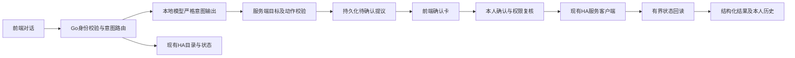

# 前端对话控制 Home Assistant 设计

日期：2026-10-09。状态：本次需求的开发方案，**待实施**；当前功能完成程度见[完整对比](../../spec-implementation-audit-2026-10-09.md)。

## 1. 需求与范围

用户要求暂不考虑微信等外部操作方式，以现有家庭前端对话控制HA。入口为`/app/chat`，继续复用Go Agent统一调度、本地Ollama、Console账号、真实设备目录和HA客户端。保留CONSTITUTION S-5：物理操作必须经人工确认。

首版规划默认：全家可查询；管理员可提出和确认控制，成员写授权后置。用户若选择成员控制，需要先具体定义对应策略与负向测试；**读取全部设备不自动获得写权限**。

首版只支持经管理员核验负载的单实体`light/switch/fan`的`turn_on/turn_off`。默认控制清单为空，配置完成后才启用。禁用toggle、场景/脚本、门锁、报警、窗帘、温控、调光、批量/区域全开关及定时命令；不支持的需求明确说明，不降级成其他动作。每项映射记录真实entity_id、人工名称/房间、允许动作及负载位置已核验标记。多路控制器按实体核验，不能按设备位置推断负载位置。

“客厅灯开了吗”返回只读实况及观察时间；“打开客厅灯”产生待确认卡；重名则列可见候选让用户选择；“昨天我说过打开灯”不得生成执行动作。聊天正文中的“确认”不替代卡片确认请求。

只读查询使用全量安全目录的`QueryTarget`，包括sensor/binary_sensor等；写动作使用经控制策略筛选的`ControlTarget`。控制清单为空不妨碍全家查询温湿度/门磁等状态，负载核验和动作域限制只作用于写控制。

## 2. 方案选择

| 方案 | 优点 | 代价/结论 |
|---|---|---|
| A：Console→Go受约束意图→ControlService→现有HA client | 复用现有身份、目录、确认体验；执行边界和历史可统一验证 | **推荐**。新增即时控制服务及结构化消息，无需通用Agent工具循环。 |
| B：Console桥接HA Assist/Ollama | 借用HA对话能力 | 默认执行行为与本项目人工确认、owner隔离难统一，需另做拦截；暂不作为主线。 |
| C：先建设完整OpenAI tools/ReAct系统 | 更通用 | 扩大API与执行面，增加与当前目标无关的改造；后续必要时复用ControlService。 |

设备名、RAG文本和模型输出都是数据，不能授权执行。LLM只可提出意图，不获得Confirm/Cancel/CallService工具。所有模型调用继续经已有`inference.Client.Chat`使用`/v1/chat/completions`；不在前端放HA/Ollama地址或令牌，不新建第二模型网关。

## 3. 复用与新增边界

- 复用`console.Store`身份/会话撤销、Console Origin/CSRF/no-store、`core.SessionManager`轮次租约、`CatalogService`、`HomeAssistantClient.GetState/CallService`、OAuth provider、安全错误码与现有输出过滤。
- 新增`ControlService`和独立即时提议存储；自动化RuleSuggestion是“持久规则安装”，不能混用其config_key表达即时动作。
- 现有`CatalogSnapshot`内部索引不是公开API；在smarthome内部提供最小候选投影，避免其他包复制注册表逻辑。
- 新控制执行仍单Go进程。存储写executing失败必须拒绝调用HA；不能先动作再尝试保存。
- 控制存储放Console受保护数据目录子目录，不能放agent-vault/personal-vault，不能被RAG或全局记忆检索。

## 4. 协议与状态

以下是**拟新增契约**，不是声称仓库已有API。字段JSON统一snake_case。

`ControlActor {UserID, SessionID string}`由服务端已认证principal与已验证会话生成；不从浏览器JSON采信角色/owner。`ControlIntent {Kind, EntityID, Action string}`的Kind为`query/on_off/clarify/chat`；EntityID只能引用服务端提供的候选，Action仅允许前述二值。

`ControlProposal`至少保存：随机ID、owner_user_id、session_id、request_id、entity_id、动作、展示名称/房间、policy_revision、created_at、expires_at、status、before/after状态及观察时间、安全error_code。过期默认120秒，持久存储默认保留30天且上限10000条；清理不能删pending/executing/unknown。达到上限时拒绝新提议并说明维护需要，不静默丢执行记录。这些值配置化并在测试中固定默认值。

`Propose`返回`ProposalOutcome{kind,proposal?,device_result?}`，kind为`proposal/already_satisfied`；already_satisfied只带实际读回的device_result，不创建伪成功提议或返回含糊nil。幂等键固定`owner_user_id + session_id + request_id`；相同键不同意图冲突。

状态：`pending → executing → succeeded/failed/unknown`；另有`cancelled/expired`。只有本人、有效登录、允许写的角色可以确认。Confirm只接收ID，目标与动作不可变；策略revision变化、实体不可用/被移除、关键before状态变化或有效期届满时拒绝旧提议并要求刷新。若提议阶段发现设备已达目标，直接返回只读“已经处于目标状态”，0次写。

执行顺序：再次校验身份/策略→GET实时state→持久executing→至多一次POST服务→有界GET回读→保存结果。默认总回读窗口10秒、间隔500ms，可取消；测试用注入clock/调度器避免真实sleep。状态成功表示观察到期望实体状态，不声称已有人现场确认物理负载。

POST超时、连接中断、401或进程在executing时退出，均不得自动重放。无法确定外部效果记unknown；Reconcile仅GET，返回当前状态和核对时间，不声称证明了因果。unknown禁止再次Confirm原ID；用户核对后如需再发，必须建立新提议并再次确认。业务失败有明确拒绝证据时才标failed。写成功后保存失败也不得谎报安全失败，应返回unknown和可核对ID。

同ID并发Confirm共享锁/原子状态跃迁，至多1次POST。按实体串行处理写操作，第二个相反指令在取得实体锁后重读、校验before，避免两个已确认旧快照互相覆盖。取消pending只改变本地状态；executing不能保证撤回，不提供自动反向回滚。

拟新增Console端点：

| 路径（前缀`/api/console/v1`） | 契约 |
|---|---|
| `POST /control/proposals` | `{session_id, request_id, entity_id, action}`；仍完整校验可信候选和策略；聊天链也调用同一服务 |
| `GET /control/proposals/:id` | 本人获取持久提议/结果；跨owner统一404 |
| `POST /control/proposals/:id/confirm` | 无新动作参数；需CSRF、Origin、有效身份与写能力 |
| `POST /control/proposals/:id/cancel` | 只取消pending |
| `POST /control/proposals/:id/reconcile` | 仅触发只读回查，绝不POST HA |

每个写入口均验证JSON未知字段、体积、权限和会话归属。400契约错误、401未登录、403无能力、404不存在/非本人、409状态/策略冲突、410过期、422无法唯一解析/动作不支持、502上游明确失败、503服务不可用。已经执行到不确定状态时返回可读取的`unknown`结果，不诱导客户端按普通网络失败自动重试。

WS现有消息兼容增加`device_result/control_proposal/control_result`事件，字段为`session_id/request_id`与安全DTO；保留原text/response/error结构。`core.Message`仅新增可选附件，持久化时只存proposal_id等引用；恢复历史以服务端控制存储当前状态为准，过期或删除不能重新显示可执行按钮。最终执行事实由结构化DTO显示，不让模型编造“操作成功”。

WS聊天输入新增可选`request_id`；新前端每次用户主动发送生成随机ID，明确重发同一输入时复用该ID，不自动重发控制。旧客户端缺ID由服务端生成并回传，不能承诺其跨连接重发幂等。第一轮由服务端分配真实session_id后建立幂等记录；前端先保存该ID，后续显式重发带回原session_id/request_id。另一会话使用相同request_id必须独立处理，不能返回原会话提议。

## 5. 意图解析与模型验证

在Go chain中增加受约束意图路由，普通chat/RAG继续走原流程。模型输入使用有限候选和必要状态字段，首版上限20个；超过或匹配含糊先请求房间/名称澄清，不把全家原始attributes或凭据加入prompt。实体匹配先精确名称/明确别名，未命中不猜；从澄清选择的ID仍再次授权验证。

使用现有本地模型和严格JSON schema，通过OpenAI兼容`response_format`进行内部请求；实际部署支持情况必须用本机模型契约测试确认。模型不支持/输出坏JSON/未知字段/虚构entity均失败关闭，继续显示普通错误或澄清；不回退成文本正则直接执行。公共REST的任意tools能力维持现状，不为内部意图解析隐式扩大支持面。

测试集至少50条中文指令，包含查询、明确单设备动作、重名、否定/引用/假设、未支持域、多设备、伪造entity、prompt injection。目标：未确认写次数=0，越权写=0；支持范围内唯一目标正确率≥95%，其余必须澄清/拒绝，不得误操作。评测记录模型tag、digest、prompt/schema版本、温度与候选数量；性能先测实际P50/P95，不编造延迟承诺。

## 6. 前端体验和现场验收

卡片明确显示房间、负载名称、当前状态/观察时间、目标动作、有效期、确认/取消。连点、断连、迟到响应和切账号沿用identity epoch；恢复时读取提议，不自动发送动作。unknown显示“结果尚未确认，核对状态”，按钮只能Reconcile；后台已开始执行时不将前端取消显示成撤回成功。

成员界面仍能查询全部设备；默认不显示可确认控制按钮。键盘焦点、屏幕阅读标签、320/390/768/1440窄屏与历史刷新使用现有Go fixture做浏览器回归。

模拟验收通过后，单独进行真实设备验收：由用户指定一台低风险负载及现场人员，核对位置/实体→前端提议→人工确认→HA回读→现场观察。再单独测试WAN断开/恢复、HA和设备重启、凭据跨有效期，记录不支持LAN的型号；不能用mock或HA200替代物理事实。

## 7. 暂缓项与外部依据

微信/企业微信/类似消息入口、云模型、通用tools/ReAct、自动确认、任意HA代理、批量控制、规则编辑停用、其他动作域、跨站嵌入和云/k3s不进入首版。

2026-10-09核对官方资料：HA服务调用与状态读取是不同接口，修改`/api/states`不能代替控制物理设备；回读作为独立步骤。[HA REST API](https://developers.home-assistant.io/docs/api/rest/)

HA WS提供认证/请求关联等基础，但现有REST有界回读足以交付首版。[HA WebSocket API](https://developers.home-assistant.io/docs/api/websocket/)

Ollama提供结构化输出机制；这只约束输出格式，服务端仍须核验实体/权限/动作，并验证本机兼容端点。[Ollama Structured Outputs](https://docs.ollama.com/capabilities/structured-outputs)
